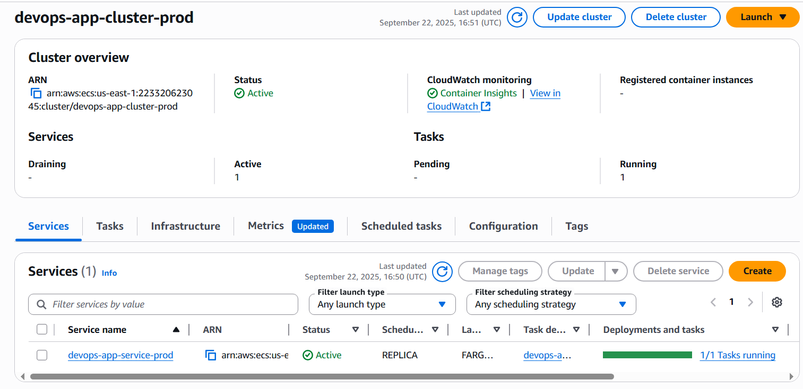

# 🚀 DevOps Solution

---

## 🗂️ Architecture & Workflow Diagrams

### Infrastructure Workflow
```
+-------------------+      +-------------------+      +-------------------+
|   User Request    | ---> |   ALB (HTTP/SSL)  | ---> |   ECS Fargate     |
+-------------------+      +-------------------+      +-------------------+
                                                        |
                                                        v
                                                +-------------------+
                                                |   Flask App       |
                                                +-------------------+
```

### CI/CD Pipeline Workflow
```
+---------+      +--------+      +--------+      +--------+      +--------+
| GitHub  | ---> | Source | ---> | Build  | ---> |  Test  | ---> | Deploy |
+---------+      +--------+      +--------+      +--------+      +--------+
     |               |               |               |               |
     v               v               v               v               v
CodeStar      CodePipeline     CodeBuild      CodeBuild      CodeBuild
Connection    (Stages)         (Docker/ECR)   (Pytest)       (ECS Update)
```

---

## 📝 Overview
This repository contains a sample DevOps solution implemented in Python and AWS. It demonstrates:
- **Flask API** with a `/healthcheck` endpoint
- **Containerization** using Docker & Docker Compose
- **Infrastructure as Code** with AWS CDK (Python): ECS, VPC, ALB, ECR, CI/CD pipeline
- **Deployment scripts** for infrastructure and pipeline
- **Unit tests** for healthcheck

---

## 📁 Solution Structure
| Path/Script                | Purpose                                 |
|---------------------------|-----------------------------------------|
| `main.py`                 | Flask API source code                   |
| `Dockerfile`, `docker-compose.yml` | Containerization setup              |
| `cdk/`                    | AWS CDK stacks and configuration        |
| `tests/`                  | Unit tests                              |
| Batch scripts (`.bat`)    | Setup and deployment automation         |

---

## 🧑‍💻 Local Development & Testing
1. **Prerequisites**: Docker, Python 3.12+, Poetry
2. **Run Application Locally**:
    ```bash
    docker compose up
    ```
    App available at: [http://localhost:3000/healthcheck](http://localhost:3000/healthcheck)
3. **Run Unit Tests**:
    ```bash
    docker compose run app poetry run pytest -s
    ```

---

## 🚢 Deployment Steps

### 1. Environment Setup
```bat
setup-env.bat
```

### 2. AWS CDK Setup
```bat
setup-cdk.bat
```

### 3. Configuration
- Update environment settings in `cdk/configs/environments.json` as needed
- Update GitHub repo info in `cdk/stacks/pipeline_stack.py`

### 4. Deploy Infrastructure
> **Note:** On first deployment, ECS may be unhealthy until the image is pushed and the tag is modified by the pipeline.
```bat
deploy-infra.bat [env]
```
Default `env`: `dev`. Supported: `dev`, `staging`, `prod`.

### 5. Deploy CI/CD Pipeline
> **Note:** Pipeline includes source, build, test, deploy. CodeStar connection must be manually approved in AWS Console when first created.
```bat
deploy-pipeline.bat [env]
```

### 6. Push Code & Trigger Pipeline
Push code to the configured GitHub branch. The pipeline will build, test, and deploy the Docker image to ECS.

---

## 🏗️ Infrastructure Details

This solution provisions the following AWS resources using AWS CDK (Python):

- **VPC**: Custom VPC with public and private subnets, 1 NAT gateway.
- **ECS Cluster**: Fargate-based cluster with container insights enabled.
- **ECR Repository**: Stores Docker images for each environment.
- **CloudWatch Log Group**: Centralized logging for ECS tasks.
- **Security Groups**: Separate groups for ALB and ECS service, with HTTP/HTTPS ingress rules.
- **Application Load Balanced Fargate Service**:
  - Deploys the Flask app as a container.
  - Health check endpoint: `/healthcheck`.
  - Auto-scaling based on CPU and memory utilization.

---

## 🔄 CI/CD Pipeline Details

The CI/CD pipeline is built with AWS CodePipeline and CodeBuild, and includes:

- **Source Stage**: Pulls code from GitHub using CodeStar Connection (manual approval required on first setup).
- **Build Stage**: Builds and tags Docker image, pushes to ECR, generates `imagedefinitions.json`.
- **Test Stage**: Pulls the built image and runs unit tests using Poetry and Pytest inside a container.
- **Deploy Stage**: Updates ECS service with the new image by:
  - Fetching current task definition
  - Registering a new task definition with updated image URI
  - Updating ECS service and waiting for stability

**Artifacts**: S3 bucket is used for pipeline artifacts (build/test outputs).

**IAM Roles**: Each CodeBuild project uses a dedicated IAM role with least privilege for ECR, S3, ECS, and logging.

**Environment Configuration**: All environment-specific settings (branch, resource names, scaling, etc.) are managed in `cdk/configs/environments.json`.

---

## ⚠️ Operational Notes
- On first deployment, ECS service may be unhealthy until the pipeline pushes the image and apply the new task definition.
- CodeStar Connection must be manually approved in AWS Console when first created.
- **Updating container environment variables**:
  - To update environment variables for the Flask container, modify the `environment` section in the ECS service definition in `cdk/stacks/infrastructure_stack.py` (see `environment={...}` in `add_container`).
  - After making changes, redeploy the infrastructure stack with `deploy-infra.bat [env]` and trigger a new pipeline run to update the running containers.
  - **If using sensitive values (e.g., secrets, tokens):**
    - Store sensitive values in AWS Secrets Manager or SSM Parameter Store.
    - Grant permissions to the ECS task execution role to retreive secrets.
    - Reference these secrets in the ECS task definition
- **SSL/TLS configuration**:
  - The infrastructure code includes commented lines for attaching an ACM certificate to the Application Load Balancer for HTTPS support.
  - To enable SSL, uncomment the certificate-related lines in `cdk/stacks/infrastructure_stack.py`, provide your ACM certificate ARN, and set the ALB listener port to `443`.

---

## 🚧 Potential Improvements
- Move container environment variables, repo name, and GitHub user to external config files for easier management and flexibility.
- Enhance the CI/CD pipeline and IaC so that any changes to pipeline stages or infrastructure (e.g., adding a new stage, updating IaC) are automatically deployed on code commit, without requiring manual deployment steps.

## 📸 Sample Screenshots

Below are sample screenshots showing a successful pipeline run and ECS service deployment

### 1. CI/CD Pipeline Run


### 2. ECS Service Deployment


### 3. Test The Load Balancer Endpoint


---